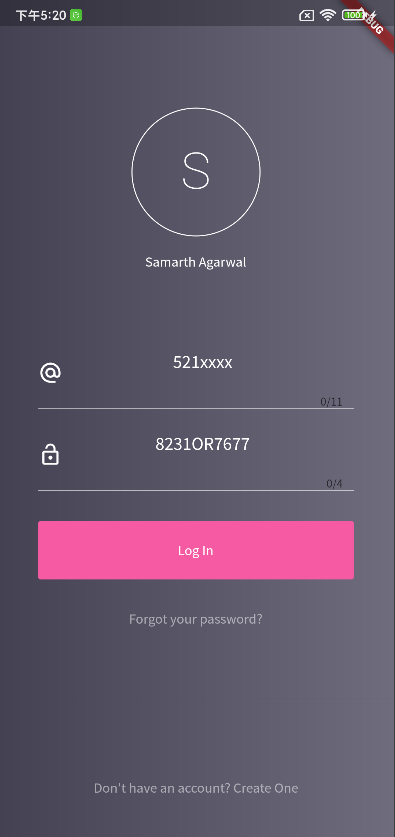
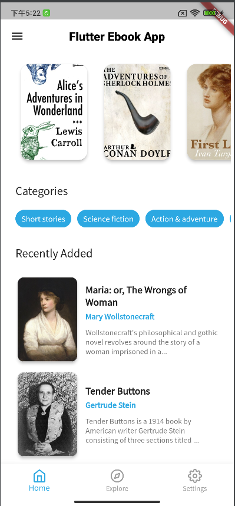
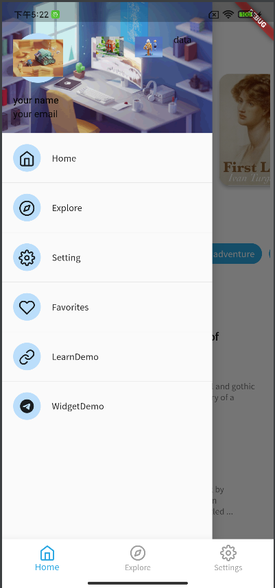
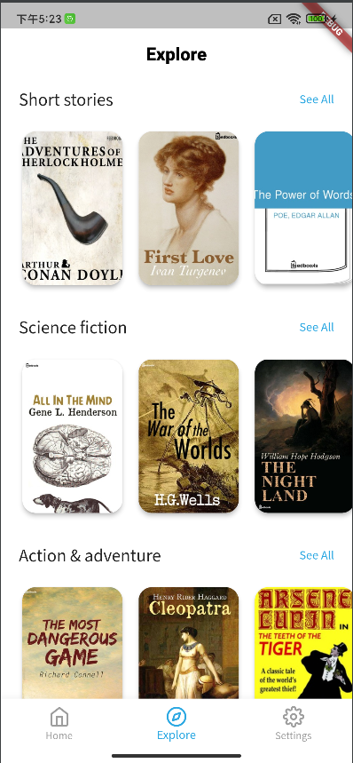
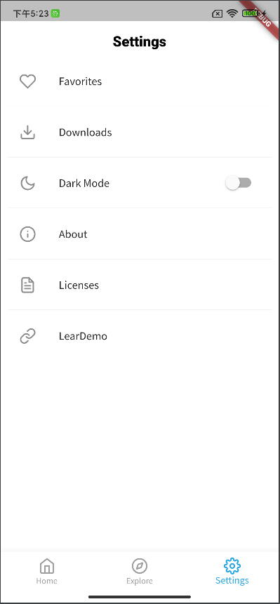
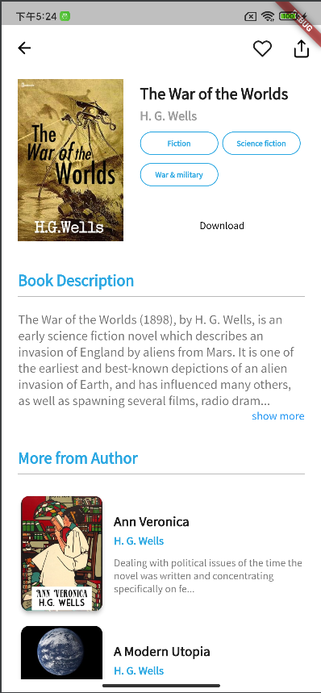
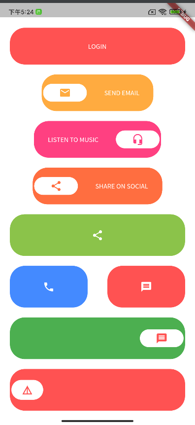
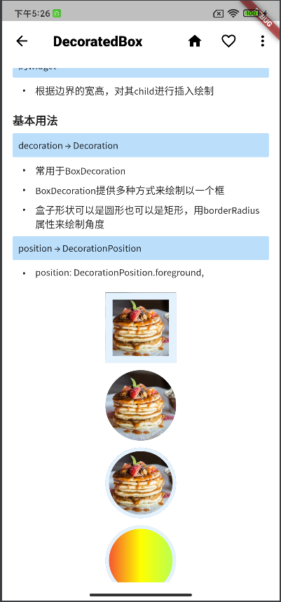
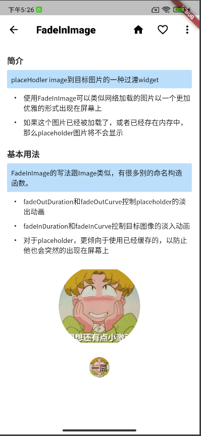
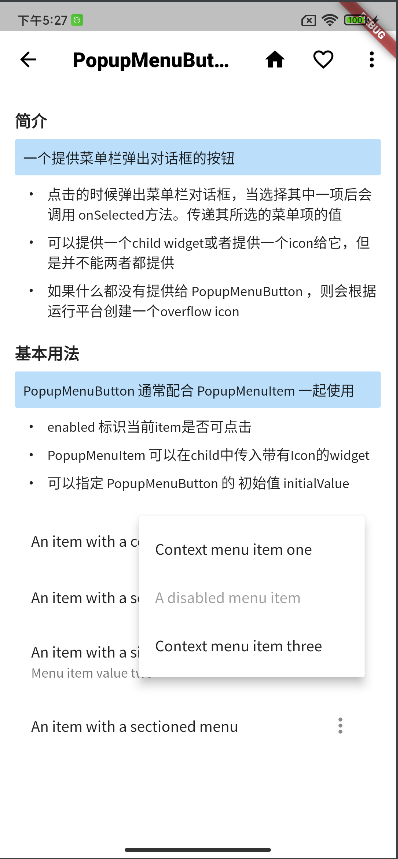

# flutter_one

A new Flutter project.

## Getting Started

This project is a starting point for a Flutter application.

A few resources to get you started if this is your first Flutter project:

- [Lab: Write your first Flutter app](https://docs.flutter.dev/get-started/codelab)
- [Cookbook: Useful Flutter samples](https://docs.flutter.dev/cookbook)

For help getting started with Flutter development, view the
[online documentation](https://docs.flutter.dev/), which offers tutorials,
samples, guidance on mobile development, and a full API reference.
| Light                             | Dark                              |
| --------------------------------- | --------------------------------- |
|   |   |
|   |   |
|   |   |
|   |   |
|   |  |
|  |

## 🔌 Plugins

| Name                                                    | Usage                                               |
| ------------------------------------------------------- | --------------------------------------------------- |
| [**Provider**](https://pub.dev/packages/provider)       | State Management                                    |
| [**Object DB**](https://pub.dev/packages/objectdb)      | NoSQL database to store Favorites & Downloads       |
| [**XML2JSON**](https://pub.dev/packages/xml2json)       | Convert XML to JSON                                 |
| [**DIO**](https://pub.dev/packages/dio)                 | Network calls and File Download                     |
| [**EPub Viewer**](https://pub.dev/packages/epub_viewer) | A flutter plugin for Folioreader to read ePub files |

## Recommend提升UI生产力

| Name                                             | Usage      |
|--------------------------------------------------|------------|
| [**常用UI推荐库**](https://juejin.cn/post/7147437014026043399) | UI Plugins |
