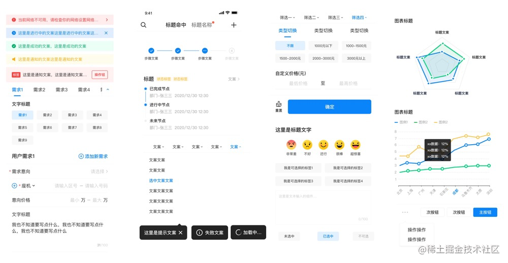
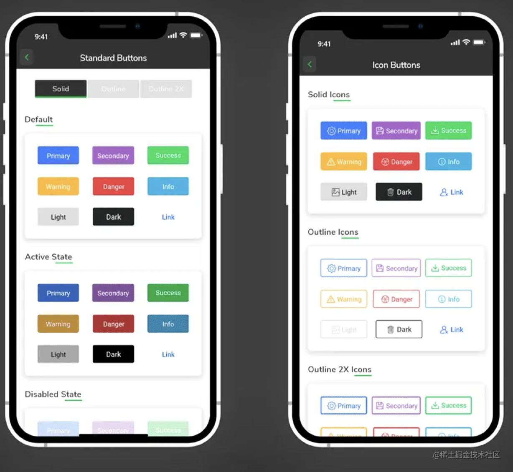
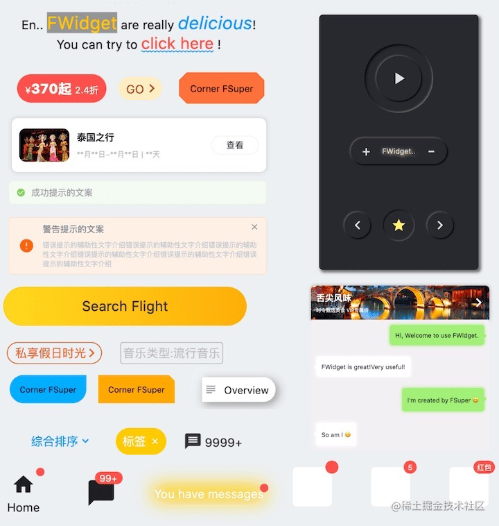

# flutter_one

A new Flutter project.

## Getting Started

This project is a starting point for a Flutter application.

A few resources to get you started if this is your first Flutter project:

- [Lab: Write your first Flutter app](https://docs.flutter.dev/get-started/codelab)
- [Cookbook: Useful Flutter samples](https://docs.flutter.dev/cookbook)

For help getting started with Flutter development, view the
[online documentation](https://docs.flutter.dev/), which offers tutorials,
samples, guidance on mobile development, and a full API reference.
| Light                             | Dark                              |
| --------------------------------- | --------------------------------- |
|   |   |
|   |   |
|   |   |
|   |   |
|   |  |
|  |

## 🔌 Plugins

| Name                                                               | Usage                                               |
|--------------------------------------------------------------------| --------------------------------------------------- |
| [**Provider**](https://pub.dev/packages/provider)                  | State Management                                    |
| [**Object DB**](https://pub.dev/packages/objectdb)                 | NoSQL database to store Favorites & Downloads       |
| [**XML2JSON**](https://pub.dev/packages/xml2json)                  | Convert XML to JSON                                 |
| [**DIO**](https://pub.dev/packages/dio)                            | Network calls and File Download                     |
| [**EPub Viewer**](https://pub.dev/packages/epub_viewer)            | A flutter plugin for Folioreader to read ePub files |

## 🔌 Search Plugins Resources

| Name                                                                           | Usage                |
|--------------------------------------------------------------------------------|----------------------|
| [**DartPackage**](https://pub.flutter-io.cn/)                                  | 插件搜索库                |
| [**gsy_flutter_book**](https://github.com/CarGuo/gsy_flutter_book/blob/master) | Flutter学习避坑教程        |
| [**add-to-app**](https://flutter.cn/docs/development/add-to-app)               | Flutter to NativeApp |
| [**Flutter Kno**](https://mp.weixin.qq.com/mp/appmsgalbum?__biz=Mzg5OTYxODg2OQ==&action=getalbum&album_id=2282930670148714499&scene=173&from_msgid=2247483852&from_itemidx=1&count=3&nolastread=1#wechat_redirect)                                | 博客知识解析               |
| [**Flutter Example **](https://flutterbyexample.com/) | A complete Dart and Flutter tutorial |

## Recommend提升UI生产力

| Name                                                      | Usage                               |
|-----------------------------------------------------------|-------------------------------------|
| [**常用UI推荐库**](https://juejin.cn/post/7147437014026043399) | UI Plugins                          |
| [**贝壳bruno**](https://github.com/LianjiaTech/bruno)       |  |
| [**getwidget**](https://github.com/ionicfirebaseapp/getwidget)      |  |
| [**fsuper**](https://github.com/Fliggy-Mobile/fsuper)       |  |
| [**fluttercandies**](https://github.com/fluttercandies)       | UI Plugins |

### AppBar

| Name                                                      | Usage                               |
|-----------------------------------------------------------|-------------------------------------|
| [**draggable_home**](https://github.com/4-alok/draggable_home) | UI Plugins                          |
| [**extended_sliver**](https://github.com/fluttercandies/extended_sliver)       | UI Plugins |
| [**scroll_app_bar**](https://github.com/edsonbonfim/scroll_bars/tree/master/scroll_app_bar)      | UI Plugins |

### Drawer

| Name                                                      | Usage                               |
|-----------------------------------------------------------|-------------------------------------|
| [**sidebarx**](https://github.com/Frezyx/sidebarx) | UI Plugins                          |
| [**flutter_advanced_drawer**](https://github.com/alex-melnyk/flutter_advanced_drawer)       | UI Plugins |
| [**curved_drawer**](https://github.com/undrbridge/curved_drawer)      | UI Plugins |

### Tarbar

| Name                                                      | Usage                               |
|-----------------------------------------------------------|-------------------------------------|
| [**flutter-cupertino-tabbar**](https://github.com/aliyigitbireroglu/flutter-cupertino-tabbar) | UI Plugins                          |
| [**tab_indicator_styler**](https://github.com/adar2378/tab_indicator_styler)       | UI Plugins |
| [**tab_container**](https://github.com/sourcemain/tab_container)      | UI Plugins |

### BottomBar

| Name                                                      | Usage                               |
|-----------------------------------------------------------|-------------------------------------|
| [**curved_navigation_bar**](https://github.com/rafalbednarczuk/curved_navigation_bar) | UI Plugins                          |
| [**salomon_bottom_bar**](https://github.com/lukepighetti/salomon_bottom_bar)       | UI Plugins |
| [**bubble_bottom_bar**](https://github.com/westdabestdb/bubble_bottom_bar)      | UI Plugins |

###  Splash

| Name                                                      | Usage                               |
|-----------------------------------------------------------|-------------------------------------|
| [**concentric_transition**](https://pub.dev/packages/concentric_transition) | UI Plugins                          |
| [**nice_intro**](https://github.com/Ethiel97/nice_intro)       | UI Plugins |
| [**IntroViews-Flutter**](https://github.com/aagarwal1012/IntroViews-Flutter)      | UI Plugins |

### 角标

| Name                                                      | Usage                               |
|-----------------------------------------------------------|-------------------------------------|
| [**flutter_badges**](https://github.com/yadaniyil/flutter_badges) | UI Plugins                          |
| [**corner_decoration**](https://github.com/kalaganov/corner_decoration)       | UI Plugins |

### 动画按键

| Name                                                      | Usage                               |
|-----------------------------------------------------------|-------------------------------------|
| [**FlutterAnimatedButton**](https://github.com/NikhilVadoliya/FlutterAnimatedButton) | UI Plugins                          |
| [**progress-state-button**](https://github.com/slm/progress-state-button)       | UI Plugins |

### 头像

| Name                                                      | Usage                               |
|-----------------------------------------------------------|-------------------------------------|
| [**avatar_stack**](https://github.com/cyrax111/avatar_stack) | UI Plugins                          |
| [**overflow_view**](https://github.com/letsar/overflow_view)       | UI Plugins |

### swipe 卡片

| Name                                                      | Usage                               |
|-----------------------------------------------------------|-------------------------------------|
| [**swipe_deck**](https://github.com/retroportalstudio/swipe_deck.git) | UI Plugins                          |
| [**cta-flutter-tinder-card-animation**](https://github.com/codetoart/cta-flutter-tinder-card-animation)       | UI Plugins |
| [**appinio_swiper**](https://github.com/appinioGmbH/flutter_packages/tree/main/packages/appinio_swiper)       | UI Plugins |

### bottom sheet

| Name                                                      | Usage                               |
|-----------------------------------------------------------|-------------------------------------|
| [**we_slide**](https://github.com/luciano-work/we_slide) | UI Plugins                          |
| [**sliding_up_panel**](https://github.com/akshathjain/sliding_up_panel)       | UI Plugins |

### 时间轴 UI

| Name                                                      | Usage                               |
|-----------------------------------------------------------|-------------------------------------|
| [**timeline_tile**](https://github.com/JHBitencourt/timeline_tile) | UI Plugins                          |
| [**timelines**](https://pub.dev/packages/timelines)       | UI Plugins |